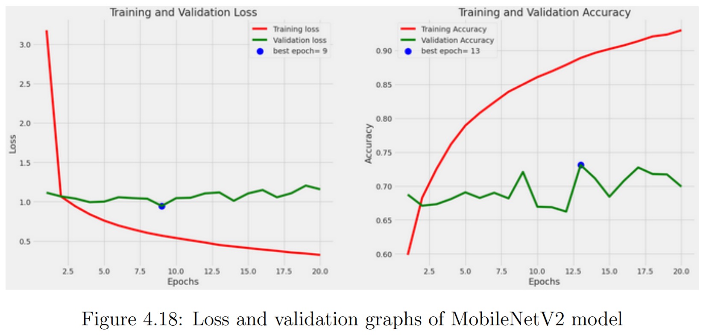
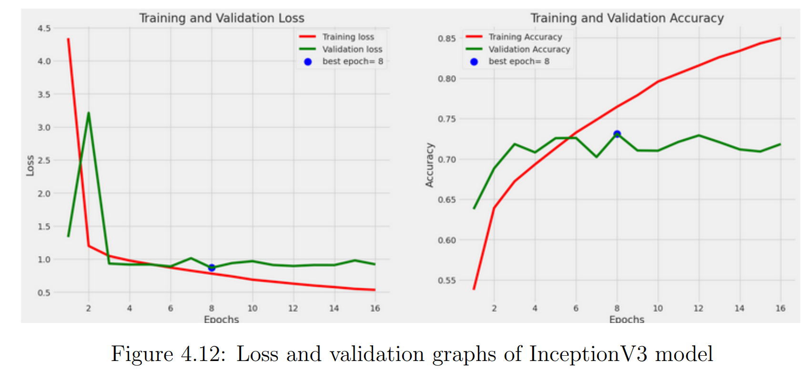

# Diabetic Retinopathy Grading using Deep Learning

This project focuses on the automatic detection and grading of diabetic retinopathy using deep learning techniques applied to retinal fundus images.

---

## Overview

Diabetic retinopathy is a leading cause of blindness. Early detection through automated systems can significantly improve diagnosis and treatment.

This project explores multiple convolutional neural network (CNN) architectures for classification and grading tasks, with a focus on performance comparison and model optimization.

---

## Dataset

The models were trained on publicly available retinal fundus image datasets for diabetic retinopathy classification.

- APTOS 2019 Blindness Detection Dataset  
- EyePACS Dataset  

Due to size limitations, the datasets are not included in this repository. They can be accessed from their original sources:

- https://www.kaggle.com/c/aptos2019-blindness-detection  
- https://www.kaggle.com/c/diabetic-retinopathy-detection  

The datasets were preprocessed and augmented to improve model generalization.

---

## Models Used

- InceptionV3 (Binary Classification)  
- MobileNetV2 (Grading)  
- Xception  
- EfficientNetB1  
- Image preprocessing using morphological transformations  

---

## Techniques

- Data preprocessing and augmentation (including morphological filtering to enhance retinal features)
- Transfer learning  
- CNN-based classification  
- Performance evaluation  

---

## Tools & Technologies

- Python  
- TensorFlow / Keras  
- OpenCV  
- Jupyter Notebook  

---

## Project Structure

- `notebooks/` – Jupyter notebooks with experiments and model implementations  
- `report/` – Final academic report  
- `presentation/` – Project presentation slides  
- `images/` – Training graphs and model outputs  

---

## Model Performance Comparison

### Training Performance

#### MobileNetV2


#### InceptionV3


---

### Quantitative Results

| Model           | Accuracy | Precision | Recall | F1-Score |
|----------------|----------|----------|--------|----------|
| EfficientNetB1 | 83.46%   | 0.84     | 0.83   | 0.82     |
| InceptionV3    | 87.43%   | 0.87     | 0.87   | 0.87     |
| MobileNetV2    | **87.88%** | **0.88** | **0.88** | **0.87** |
| Xception       | 86.31%   | 0.86     | 0.86   | 0.86     |

---

### Analysis

MobileNetV2 achieved the highest overall accuracy (87.88%) with balanced precision and recall, making it the most effective model for this task.

InceptionV3 also demonstrated strong and stable performance across both classes.

EfficientNetB1 showed lower recall for the diabetic retinopathy (DR) class, indicating limitations in detecting positive cases.

These results highlight the effectiveness of lightweight CNN architectures for medical image classification tasks.

---

## How to Run the Project

### 1. Clone the Repository

```bash
git clone https://github.com/your-username/diabetic-retinopathy-dl.git
cd diabetic-retinopathy-dl
```

---

### 2. Install Dependencies

Make sure you have Python (3.8 or higher) installed.

```bash
pip install tensorflow keras opencv-python numpy matplotlib jupyter
```

---

### 3. Launch Jupyter Notebook

```bash
jupyter notebook
```

---

### 4. Run the Notebooks

Navigate to the `notebooks/` folder and open:

- `binary-classification-for-dr-InceptionV3.ipynb`  
- `Grading_MobileNetV2.ipynb`  
- `combined-datasets-morph-transformations.ipynb`  

Run the cells step by step to reproduce the experiments.

---

### Notes

- The datasets are not included due to size limitations. Please download them from the links above.  
- Update dataset paths inside the notebooks before running the code.  

---

## Author

Chaima Ahmed Gaid  
Amira Temmam  
